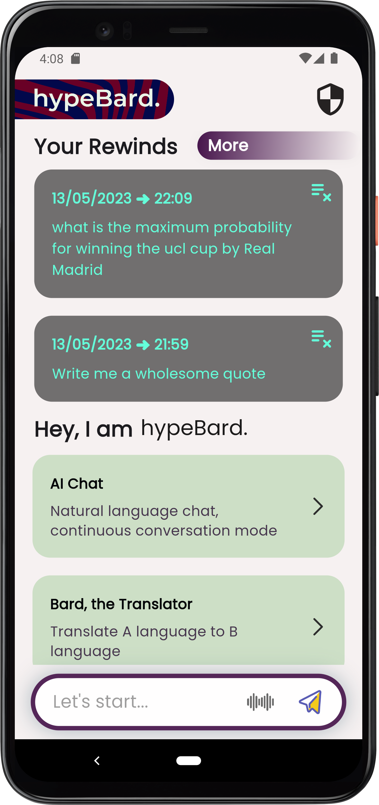
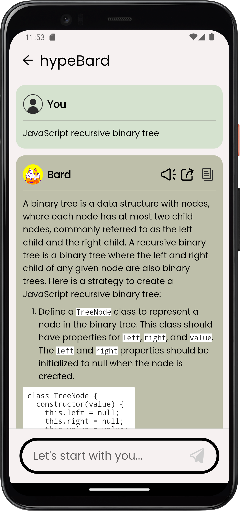
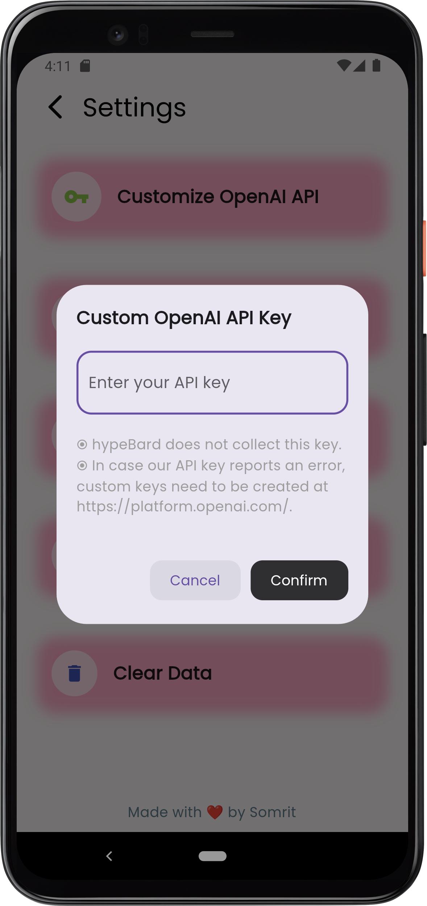

[](https://opensource.org/licenses/MIT)
  
  <div style="flex: 2;">
    <p>Hypebard is an AI-powered writing assistant that makes writing easier and more enjoyable than ever before. Built using Flutter and written in Dart, Hypebard uses OpenAI's GPT technology to provide you with natural language processing capabilities that are second to none.</p>
  </div>
</div>

## Features

* Advanced AI-powered writing assistance
* Beautiful and intuitive UI
* Support for all formatting: bold, italics, links, code blocks, and bullets

## Screenshots

| Screenshot 1                                 | Screenshot 2                                 | Screenshot 3                                 |
|----------------------------------------------|----------------------------------------------|----------------------------------------------|
|  |  |  |

## Installation

You can download the APK file from the releases section of this repository or build the app from source using the
instructions below:

```bash
git clone https://github.com/somritdasgupta/hypebard.git
cd hypebard
flutter build apk
````

## Usage

To use Hypebard, simply type or dictate your text into the app, and the AI will provide you with natural language
processing assistance. You can also format your text using the provided formatting options.

## Contributing

Contributions are welcome! Please read the [contribution guidelines](CONTRIBUTING.md) before getting started.

## License

Hypebard is licensed under the [MIT License](LICENSE).

## Acknowledgements

Hypebard was built using the following open-source libraries and tools:

* [Flutter](https://flutter.dev/)
* [Dart](https://dart.dev/)
* [OpenAI GPT](https://beta.openai.com/)
* [Travis CI](https://travis-ci.org/)
* [Google Fonts](https://fonts.google.com/)


<h3 align="left">Coffee?</h3>
<p><a href="https://www.buymeacoffee.com/somritdasgupta"> </a></p><br><br>


